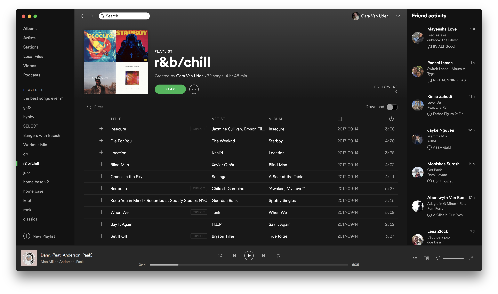

# Spotify Recsys Challenge

### Cara Van Uden for COSC 69, 18S

Spotify is an online music streaming service with over 140 million active users and over 30 million tracks. One of its popular features is the ability to create playlists, and the service currently hosts over 2 billion playlists.

This year's challenge focuses on music recommendation, specifically the challenge of automatic playlist continuation. By suggesting appropriate songs to add to a playlist, a recommender system can increase user engagement by making playlist creation easier, as well as extending listening beyond the end of existing playlists. The goal of the challenge is to develop a system for the task of automatic playlist continuation. Given a set of playlist features, my recommender system should generate a list of recommended tracks that can be added to that playlist to ‘continue’ the playlist.

### Dataset

As part of this challenge, Spotify has released the Million Playlist Dataset. The MPD contains a million user-generated playlists that were created during the period of January 2010 through October 2017. Each playlist in the MPD contains a playlist title, the track list (including track metadata such as artist, album, and track duration) editing information (last edit time, number of playlist edits) and other miscellaneous information about the playlist.

### Questions (besides the obvious challenge of building an effective recommender system!)

This dataset was collected between January 2010 to October 2017. What were the top tracks, artists, and genres (measured through playlist titles) at this time?

Are there natural patterns that fall out of clustering existing playlists? For example, are there playlist-level differences between different genre-specific playlists (such as rock, rap, classical) or "mood" playlists (happy, sad, studying)?

Are there any differences between collaborative and "personal" playlists?

### Overview of NeuMF neural recommendation system

1. Build sparse one-hot encoding matrix that maps relationships between users (playlists) and items (tracks).
2. Playlist (more generally called u for user) and item (i) vectors are used to create embeddings (low-dimensional) for each playlist and item.
3. Generalized Matrix Factorization (GMF) combines the two embeddings using the dot product (this is the classic matrix factorization).
4. Multi-layer perceptron (MLP) can also create embeddings for user and items. However, instead of taking a dot product of these to obtain the rating, I can concatenate them to create a feature vector that is passed on to deeper layers.
5. NeuMF then combines the predictions from MLP and GMF to obtain the final prediction.

### Previous work

There are two basic methods of music recommendation- metadata information retrieval and collaborative filtering. Metadata information retrieval uses textual metadata (editorial information) supplied by the creators, such as the title of the song, artist name, and lyrics to find some target songs. Though it is fast and accurate, the drawbacks are obvious. First of all, the user has to know about the editorial information for a particular music item. Secondly, it is also time consuming to maintain the increasing metadata. Moreover, the recommendation results is relatively poor, since it can only recommend music based on editorial metadata and none of the users’ information has been considered.

Collaborative filtering is able to recommend items via the choice of other similar users. As one of the most successful approaches in recommendation systems, it assumes that if user X and Y rate n items similarly or have similar behavior, they will rate or act on other items similarly. Instead of calculating the similarity between items, a set of ‘nearest neighbor’ users for each user whose past ratings have the strongest correlation are found. Therefore, scores for the unseen items are predicted based on a combination of the scores known from the nearest neighbors.

For this project, I will use neural collaborative filtering (He et al, 2017), implemented in Keras with a Tensorflow backend, to build my playlist recommendation system. I also plan to do some exploratory analyses, like looking at numbers of unique tracks, artists, albums, etc. I may also do some playlist clustering and PCA, to find interesting patterns in these user-generated playlists. I'm also interested in the social aspect of playlist creation- are there any distinguishing features of collaborative playlists?

### Major findings

I found the top artists, tracks, and most-followed playlists for the data (from the period Jan 2010- Oct 2017). See my exploratory anaylses for the complete top-20 lists.

By using kmeans to cluster playlists by genre, I found that there are not playlist-level features (besides name, of course) that differentiate playlists from different genres. Interestingly, the rock, country, and party genres had the highest f-scores (of 0.13, 0.12, and 0.11, respectively) under my model out of all of the genres. 

After removing multicollinear features, I used cross-validated logistic regression to predict whether a playlist is collaborative or not. I acheived an f-score of 0.747 and an ROC AUC of only 0.558. However, I found that that collaborative playlists have more edits and unique artists, but fewer followers, than personal playlists (significant differences between the classes using a Kruskal-Wallis ANOVA). I like that collaborative playlists have a greater diversity of artists- this means that people bring their own music knowledge to the table when collaborating to build a playlist!

I built a NeuMF recommender system, but due to time and resource constraints could only train it on 1/100th of the data. My model achieves an accuracy of 0.97 after 5 epochs and is able to recommend songs, but in practice they're not the most accurate (how about some Latin dance music for your rock playlist?). 

### Future work

In the future, I would train my NeuMF model on the complete Spotify MPD. Also, I would attempt to extract playlist embeddings (under my model) for new playlists to implement prediction on the challenge set. I would also be interested at looking at how track-level features differ between playlist genres. This data was also anonymized, so I had **very** limited access to social information (ie, user followers, each user's profile, and other social networks). This would have been very interesting to look into and incorporate into my model (I could boost performance by seeing what music your friends like).

### Citations

+ [Spotify MPD](https://recsys-challenge.spotify.com/dataset)
+ [A general overview of recommendation systems](http://webprojects.eecs.qmul.ac.uk/marcusp/papers/SongDixonPearce-CMMR2012.pdf)
+ [Neural collaborative filtering, He et al 2017](https://arxiv.org/pdf/1708.05031.pdf)

### Jupyter Notebooks
+ [Exploratory analyses](exploratory_analysis.html)
+ [NeuMF model for Spotify MPD](neural_collaborative_filtering.html)

